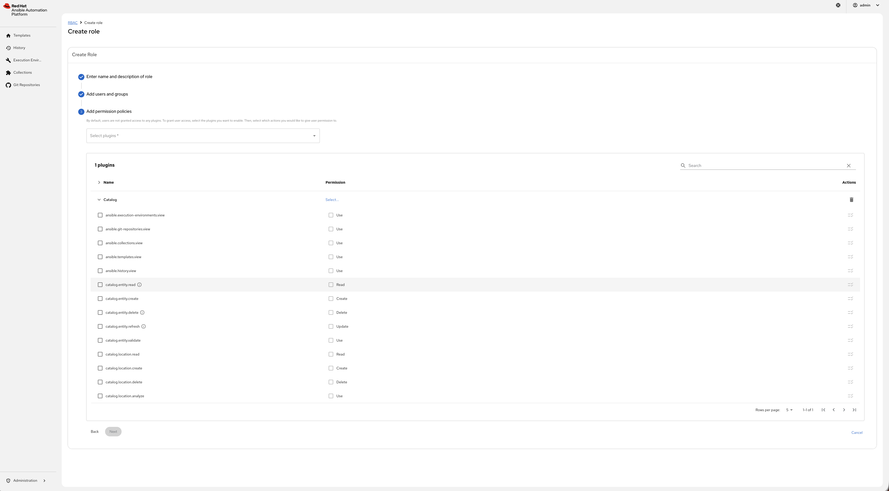
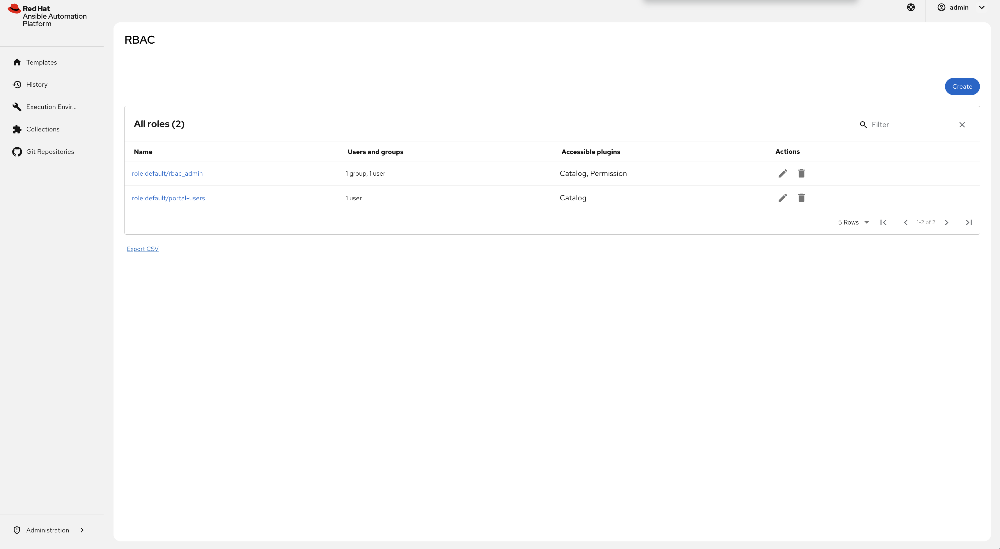

# AAP Self-Service Automation Portal on OpenShift — full setup

End-to-end, battle-tested instructions for deploying the **Red Hat Ansible
Automation Platform 2.6 self-service automation portal** on OpenShift:
AAP via the **operator**, the portal via the **`redhat-rhaap-portal` Helm
chart**, plus the RBAC configuration that the official docs currently miss.
Everything here was validated on a real cluster (ROSA), including the failure
modes — see [docs/TROUBLESHOOTING.md](docs/TROUBLESHOOTING.md).

## Architecture

```
┌───────────────────────────── OpenShift (namespace: aap) ─────────────────────────────┐
│                                                                                      │
│  AAP operator (stable-2.6)                    Helm release: redhat-rhaap-portal      │
│  └─ AnsibleAutomationPlatform "aap"           └─ portal (RHDH/Backstage 1.9 based)   │
│     ├─ platform gateway  ◄── OAuth2 (authorization-code) ──  rhaap auth plugin       │
│     │   (unified UI, OAuth apps)  ◄── PAT token (sync) ──    rhaap catalog plugin    │
│     ├─ automation controller                                 self-service UI plugin  │
│     └─ postgres / redis                                      RBAC plugin             │
└──────────────────────────────────────────────────────────────────────────────────────┘
```

Key facts worth knowing before you start:

- The portal ships **only** as a Helm chart for OpenShift (no RPM variant).
- The portal talks to the **platform gateway** URL everywhere (OAuth app,
  `aap-host-url`, sync). Never the controller route — the controller has no
  standalone UI since AAP 2.5.
- The portal plugins are versioned independently of AAP: chart/plugins 2.2.x
  pair with AAP 2.6. Do not set `imageTagInfo` to an AAP version.

## Prerequisites

- OpenShift cluster (this was validated on ROSA) with cluster-admin-ish access.
- `oc`, `helm`, `python3` locally. Optionally `podman` (only for the manual
  registry-auth path).
- Red Hat registry access (a `registry.redhat.io` entry in the cluster global
  pull secret — standard on ROSA/OSD — or your own service account).

## Step 1 — Install the AAP operator

OperatorHub → **Ansible Automation Platform** → channel `stable-2.6`, install
into a dedicated namespace (this repo assumes `aap`). Wait until the operator
CSV reports `Succeeded`:

```bash
oc get csv -n aap
```

## Step 2 — Deploy a minimal AAP instance

```bash
oc apply -f manifests/aap-instance.yaml
```

This deploys gateway + controller only (EDA/Hub/Lightspeed disabled; Hub also
needs RWX storage, which many managed clusters do not offer). Provisioning
takes ~5–20 min. Then:

```bash
oc get route aap -n aap -o jsonpath='{.spec.host}'      # gateway URL — the one you browse
oc extract secret/aap-admin-password -n aap --to=-      # admin password
```

Log in at the **gateway** route as `admin` and verify the UI loads. If you see
raw `<% ... %>` text, you are on the controller route — see troubleshooting §1.

## Step 3 — Configure the gateway for the portal

Scripted (recommended — creates the OAuth application, the sync token, and
optionally two test users):

```bash
export AAP_HOST=$(oc get route aap -n aap -o jsonpath='{.spec.host}')
export PORTAL_HOST=redhat-rhaap-portal-aap.$(oc get ingresses.config.openshift.io cluster -o jsonpath='{.spec.domain}')
export AAP_PW=$(oc extract secret/aap-admin-password -n aap --to=-)
python3 scripts/aap-portal-setup.py --test-users
```

The portal route host is deterministic: `<release-name>-<namespace>.<apps-domain>`,
so the OAuth redirect URI can be set correctly before the portal exists.
Credentials land in `portal-creds.json` (git-ignored, mode 0600).

Manual equivalent (gateway UI): Access Management → OAuth Applications →
Create (grant type **Authorization code**, client type **Confidential**,
redirect URI `https://<portal-route>/api/auth/rhaap/handler/frame`); create a
personal access token for `admin` (write scope); ensure Settings → Platform
gateway → *Allow external users to create OAuth2 tokens* is enabled.

## Step 4 — Create the Kubernetes secrets

```bash
bash scripts/create-secrets.sh
```

Creates:

- `secrets-rhaap-portal` — AAP URL, OAuth client id/secret, sync token
  (consumed by the chart's `extraEnvVars`).
- `redhat-rhaap-portal-dynamic-plugins-registry-auth` — registry.redhat.io
  auth for the plugin installer. The name is **hardcoded by the chart** as
  `<release-name>-dynamic-plugins-registry-auth`. By default the script
  derives it from the cluster global pull secret; set
  `REGISTRY_AUTH_FILE=/path/to/auth.json` to use your own
  (`podman login registry.redhat.io --authfile auth.json`).

## Step 5 — Install the portal Helm chart

Edit `values/portal-values.yaml` and set `clusterRouterBase` to your apps
domain. Then:

```bash
helm repo add openshift-helm-charts https://charts.openshift.io/
helm repo update
helm install redhat-rhaap-portal openshift-helm-charts/redhat-rhaap-portal \
  -n aap -f values/portal-values.yaml
```

`portal-values.yaml` makes two deliberate choices — read the comments in the
file: `pluginMode: oci` (the chart default `tarball` requires a separately
deployed in-cluster plugin registry and otherwise fails with
`ENOTFOUND plugin-registry`), and `checkSSL: false` for self-signed lab
ingress certificates.

Watch the plugin installer (5–15 min on first run), then wait for readiness:

```bash
oc logs -f deploy/redhat-rhaap-portal -n aap -c install-dynamic-plugins
oc rollout status deploy/redhat-rhaap-portal -n aap
```

Portal URL: `https://redhat-rhaap-portal-aap.<apps-domain>` — log in with
**Sign in with RHAAP** as `admin`. Expect the full portal (Templates, History,
Execution Environments, Collections, Git Repositories).

## Step 6 — RBAC: make the portal usable for everyone else

**This is the part the official documentation gets wrong**, and the reason a
freshly installed portal shows *404 We couldn't find that page* to every user
except `admin`. Two facts (verified in the shipped code and in a live lab):

1. Every portal page is permission-gated on one of five `ansible.*.view`
   permissions. Users without them see an empty sidebar and a 404.
2. In `superUsers`, only individual `user:` entries work. The default
   `group:default/aap-admins` entry is **not expanded to group members** in
   the RBAC backend shipped with portal 2.2 (rbac-backend 7.6.2).

### 6a. Superusers (administrators)

List each administrator individually in `values/superusers-values.yaml`, then:

```bash
helm upgrade redhat-rhaap-portal openshift-helm-charts/redhat-rhaap-portal \
  -n aap --reuse-values -f values/superusers-values.yaml
oc rollout status deploy/redhat-rhaap-portal -n aap
```

### 6b. A role for regular users (`portal-users`)

As an RBAC admin in the portal: **Administration → RBAC → Create**.

1. Name: `portal-users`; add the AAP users/teams that should use the portal
   (only members of the synchronized organization are selectable).
2. In *Add permission policies*, select the **Catalog** plugin. The five
   portal page permissions are listed there (registered under Catalog by the
   AAP catalog module) — enable all five, plus `catalog.entity.read`:

   

   `ansible.templates.view`, `ansible.history.view`, `ansible.collections.view`,
   `ansible.execution-environments.view`, `ansible.git-repositories.view`

   > The official docs only mention `catalog.entity.read` + scaffolder
   > permissions — that alone leaves users at the 404.

3. Select the **Scaffolder** plugin and enable all six permissions
   (`scaffolder.template.parameter.read`, `scaffolder.template.step.read`,
   `scaffolder.action.execute`, `scaffolder.task.create`,
   `scaffolder.task.read`, `scaffolder.task.cancel`).
4. Create the role and re-login with an affected user:

   

Verification — the backend permission audit log shows the evaluations flip
from DENY to ALLOW:

```bash
oc logs deploy/redhat-rhaap-portal -n aap -c backstage-backend \
  | grep permission-evaluation | grep '<username>' \
  | grep -o '"permissionName":"[^"]*".*"result":"[^"]*"' | sort | uniq -c
```

## Step 7 — Job template synchronization

The portal syncs users/teams and job templates **hourly** from the AAP
organization in `catalog.providers.rhaap.<env>.orgs` (default `Default`).
Job templates must live in that organization to appear; users then see only
templates they hold **Execute** permission on in AAP. Force a sync with the
**Sync now** button on the Templates page (admin) or
`oc rollout restart deploy/redhat-rhaap-portal -n aap`.

## Cleanup

```bash
helm uninstall redhat-rhaap-portal -n aap
oc delete secret secrets-rhaap-portal redhat-rhaap-portal-dynamic-plugins-registry-auth -n aap
oc delete ansibleautomationplatform aap -n aap
oc delete pvc --all -n aap        # data volumes, if you want a full wipe
```

## References

- Installing self-service automation portal (AAP 2.6):
  <https://docs.redhat.com/en/documentation/red_hat_ansible_automation_platform/2.6/html-single/installing_self-service_automation_portal/index>
- Using self-service automation portal — RBAC:
  <https://docs.redhat.com/en/documentation/red_hat_ansible_automation_platform/2.6/html/using_self-service_automation_portal/self-service-rbac_aap-self-service-using>
- Portal Helm chart (`redhat-rhaap-portal`): <https://charts.openshift.io/>
- Portal plugins source: <https://github.com/ansible/ansible-backstage-plugins>
- RBAC plugin source: <https://github.com/backstage/community-plugins/tree/main/workspaces/rbac>
